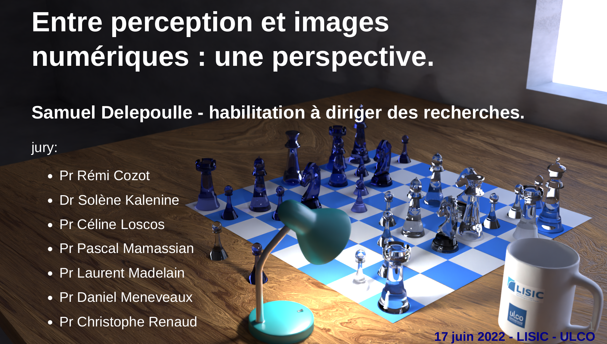

# Habilitation à Diriger des Recherches

[Samuel Delepoulle](index.html)

- [Slides de soutenance](./hdr_doc/slides_hdr_delepoulle.pdf)
- [Mémoire - version provisoire - haute qualité (42,1 Mo)](./hdr_doc/hdr_delepoulle.pdf)
- [Mémoire - version provisoire - version compressée (2,2 Mo)](./hdr_doc/hdr_delepoulle_compressed.pdf)

## Soutenance

- le 17 juin 2022 à 13h30
- Salle B014 - Calais ULCO

## Jury

- Pr Rémi Cozot
- Dr Solène Kalenine
- Pr Céline Loscos
- Pr Laurent Madelain
- Pr Pascal Mamassian
- Pr Daniel Meneveaux
- Pr Christophe Renaud

## Résumé

Le contexte scientifique des travaux présentés dans ce manuscrit concerne les apports des données perceptives à la génération d'images de synthèse photo-réalistes.

Tout d'abord un tour d'horizon des problématiques liées à la perception est effectué, en s'attachant à identifier les variables impliquées lors de la perception d'une image, numérique ou non. Certains paramètres sont à prendre en compte, au premier lieu desquels l'acuité visuelle et la sensibilité au contraste.
La question de la perception 3D pour sa part soulève des problèmes théoriques et pratiques qui sont explorés par le biais des indices de perception de la profondeur : les indices monoculaires qui sont connus des peintres et artistes graphiques ainsi que les indices binoculaires impliqués dans la vision stéréoscopique.
Nous nous focalisons ensuite sur la problématique générale de la simulation d'éclairage, pour laquelle l'utilisation des algorithmes de Monte-Carlo permet de produire des images photo-réalistes. Ces méthodes se basent sur une modélisation des sources de lumière, des matériaux, de la géométrie et du transfert de la lumière dans une scène virtuelle. Bien qu'elles permettent d'obtenir des images de très grande qualité, elles se caractérisent par une convergence relativement lente et induisent l'apparition d'artefacts visuels. Un bruit de haute fréquence spatiale est notamment visible dans les premières phases du calcul. Celui-ci s’estompe avec le nombre d'échantillons mais tend à rester très perceptible. De plus, il est difficile de déterminer un critère d'arrêt précis du calcul. 

Nos  contributions se focalisent sur ces artefacts, en utilisant des données réelles issues d'expériences utilisateurs afin de déterminer où ils sont visibles dans une image et jusqu'à quel niveau les calculs sont nécessaires pour les rendre imperceptibles. Ces travaux ont été menés dans un cadre transdisciplinaire associant les méthodes et résultats de la psychologie expérimentale aux techniques de calculs d'images numériques.