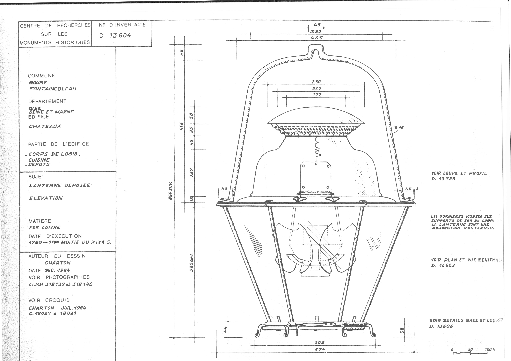
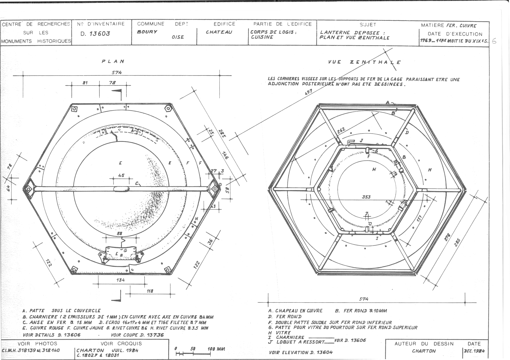
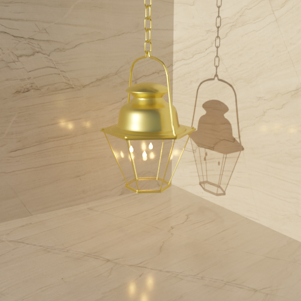
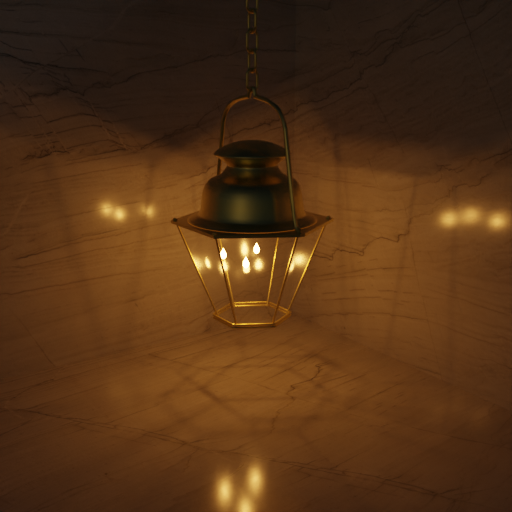
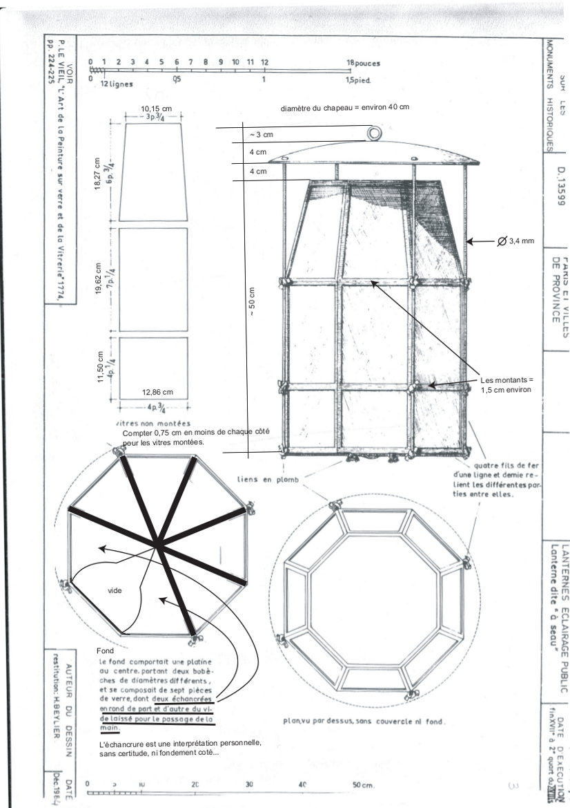
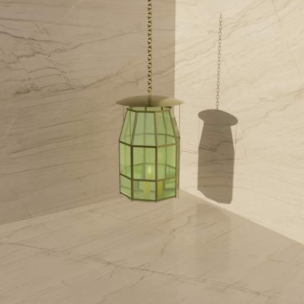
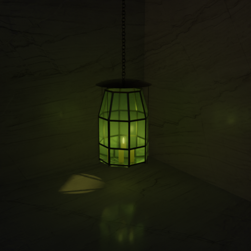
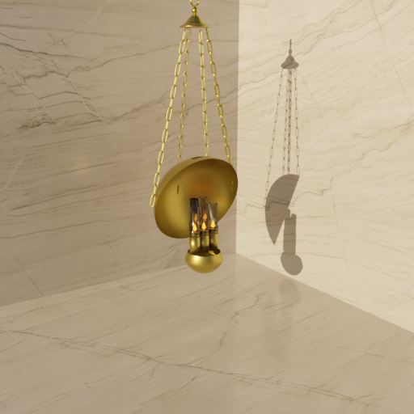
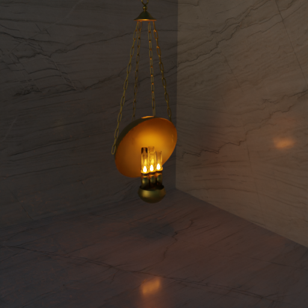

## Réverbère

### Description
Lanterne Réverbère de la commune de Boury (Oise). Utilisée dans le corps de logis, la cuisine de châteaux.

### Période
1769 - Première moitiée du XIXe siècle.

### Plans

 

### Rendus

| Rendu - jour  | Rendu - nuit    | 
| :-----------: |:---------------:| 
|  |         | 

### Fichiers 3D

| Blender | Wavefront (obj) | GLTF          |
| :-----: | :-------------: | :-----------: |
| [reverbere_2024.blend](lampes/reverbere/reverbere_2024.blend) | [reverbere_2024_obj.zip](lampes/reverbere/reverbere_2024_obj.zip) | [reverbere_2024.glb](lampes/reverbere/reverbere_2024.glb) |

## Lanterne (à seau)

### Description
Lanterne d'éclairage public, dite "à seau".

### Période
fin XVIIe à mi XVIIIe.

### Plans

 

### Rendus

| Rendu - jour  | Rendu - nuit    | 
| :-----------: |:---------------:| 
|  |     

### Fichiers 3D

| Blender | Wavefront (obj) | GLTF          |
| :-----: | :-------------: | :-----------: |
| [lanterne_a_seau_2024.blend](lampes/lanterne_a_seau/lanterne_a_seau_2024.blend) | [lanterne_a_seau_2024_obj.zip](lampes/lanterne_a_seau/lanterne_a_seau_2024_obj.zip) | [lanterne_a_seau_2024.glb](lampes/lanterne_a_seau/lanterne_a_seau_2024.glb) |

## Lampe astrale
**(update 19/04/24)**

### Description
Lampe astrale de Bordier Marcet, successeur d’Argand (1804)
Localisée : Ecole des Beaux Arts, Paris

### Période
années 1810s

### Plans

 

### Rendus

| Rendu - jour  | Rendu - nuit    | 
| :-----------: |:---------------:| 
|  |         | 

### Fichiers 3D

| Blender | Wavefront (obj) | GLTF          |
| :-----: | :-------------: | :-----------: |
| [lampe_astrale.blend](lampes/lampe_astrale/lampe_astrale.blend) | [lampe_astrale.zip](lampes/lampe_astrale/lampe_astrale.zip) | [lampe_astrale.glb](lampes/lampe_astrale/lampe_astrale.glb) |

