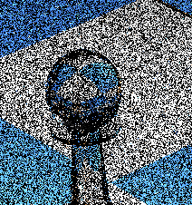
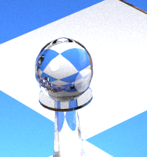

# Temporal noise

Denoising methods can be very effective in removing visual artifacts but the resulting image can be very different from the reference image.

| |   |  |
|---|---|---|
| output image with 1 spp  | 1 spp with Intel® Open Image Denoise | reference image with 10,000 spp  |

Furthermore temporal noise can appear in video if the denoising is done frame by frame.

<video width="640" height="480" controls loop autoplay>
  <source src="./noise/temporal_noise.mp4" type="video/mp4">
</video>